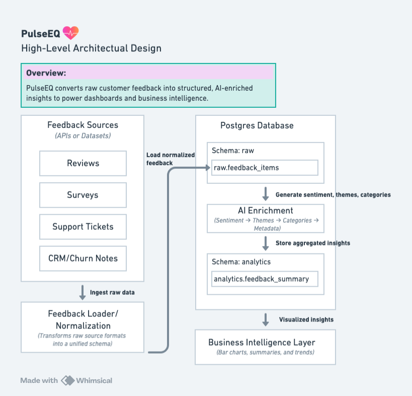

# PulseEQ

PulseEQ is an end-to-end sentiment and insights pipeline for product reviews.  
It ingests raw review data, enriches it with AI-powered sentiment and topic signals, and surfaces the results through clear, visual analytics.

## What PulseEQ Does

- **Ingests raw review data** from external sources into a structured store.
- **Cleans and normalizes** the data so it’s consistent and ready for analysis.
- **Enriches each review** with:
  - Sentiment scores
  - Category / topic labels (e.g., pricing, reliability, UX)
  - Optional AI-generated summaries
- **Scores and aggregates** results so you can answer questions like:
  - What are customers happiest or most frustrated about?
  - Which themes show up most often in negative reviews?
  - How does sentiment trend over time or by product?

## High-Level Architecture

At a high level, the pipeline flows through these stages:

1. **Sources**  
   Raw review data is pulled from external sources (e.g., public datasets, exports, or APIs).

2. **Ingestion & Loading**  
   Reviews are loaded into a **raw data store** with minimal transformation so nothing is lost.

3. **Processing & Normalization**  
   Raw data is cleaned, normalized, and mapped into a consistent schema.

4. **AI Enrichment**  
   Each review is enriched with:
   - Sentiment classification
   - Topic / category tagging
   - Optional natural language summary

5. **Scoring & Aggregation**  
   Enriched data is scored and aggregated into metrics and dimensions (by product, theme, time period, etc.).

6. **Analytics & Visualization**  
   Final data powers charts and dashboards (e.g., bar graphs by sentiment, theme frequency, and trend lines).

> See the architecture diagram in `docs/` for a visual overview of the pipeline.

## Tech Stack (Planned)

- **Language:** Python
- **Data & Storage:** (TBD; e.g., CSV/Parquet + local storage or cloud store)
- **AI / NLP:** Hugging Face models (e.g., DistilBERT or similar) for sentiment & topic signals
- **Visualization:** Python-based charts and/or BI tooling

## Environment & Dependency Management
- PulseEQ uses a reproducible Python environment to ensure consistent behavior across machines and iterations of the project.
- PulseEQ intentionally pins the `datasets` library to **version 2.19.1**.  
Newer versions of the Hugging Face `datasets` library (3.x and above) removed support for dataset scripts, which breaks ingestion for the McAuley-Lab Amazon Reviews 2023 dataset used during development.

By pinning the dependency, PulseEQ ensures:

- Stable and predictable dataset ingestion  
- Compatibility with script-based dataset loaders  
- Reproducible behavior for anyone cloning the repo  

All project dependencies—including the pinned `datasets` version—are captured in the [requirements.txt](requirements.txt) file, which is generated directly from the active virtual environment. 

### Dataset Notes
- PulseEQ uses the Toys & Games subset of the McAuley-Lab Amazon Reviews 2023 dataset for demonstration purposes. This dataset is large, realistic, and provides rich text for sentiment modeling and enrichment.
- For production use, companies should replace this dataset with their own internal review sources or domain-specific text data.

## Roadmap
- [ ] Finalize data ingestion flow for the first review dataset
- [ ] Implement basic cleaning & normalization
- [ ] Add sentiment analysis for each review
- [ ] Add topic / category tagging
- [ ] Aggregate scores and export an analytics-ready dataset
- [ ] Build initial charts (e.g., sentiment by theme, sentiment over time)
- [ ] Polish documentation and add example notebooks
- [ ] Switch to an updated parquet version of Amazon reviews

---

## Why I’m Building PulseEQ

PulseEQ is my sandbox for:
- Practicing **end-to-end data product thinking**
- Working with **real-world, messy text data**
- Exploring how AI/ML can turn raw feedback into clear, actionable insights for product teams